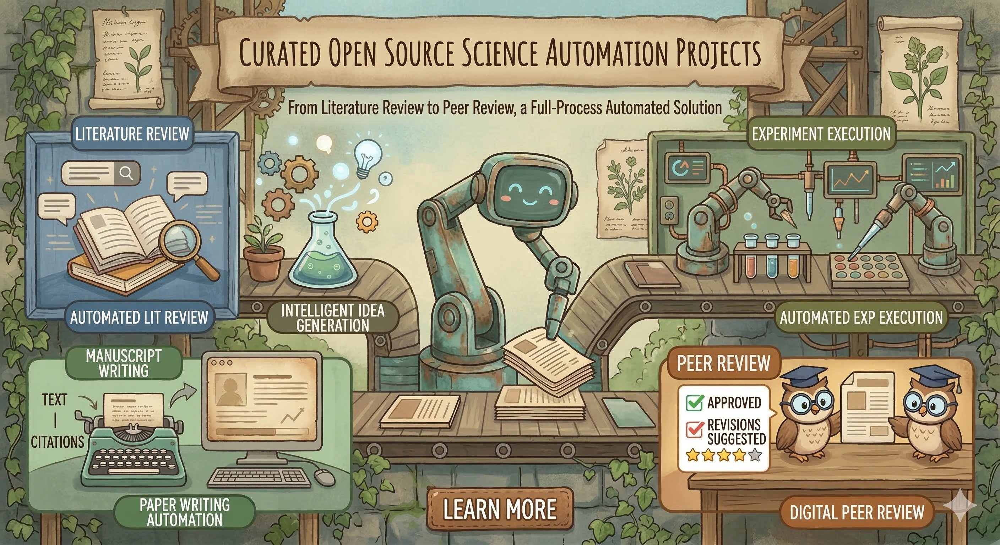

# 🔬 Awesome Auto Research [](https://awesome.re)

[English](README.md) | [中文](README_CN.md)

<p align="center">
  
</p>

> 🤖 A curated list of open-source projects that automate scientific research — from literature review to idea generation, experiment execution, paper writing, and peer review.

**📅 Star counts last verified: 2026-03-16**

---

## 📑 Table of Contents

- [🧪 End-to-End Autonomous Research Systems](#-end-to-end-autonomous-research-systems)
- [📚 Deep Research & Literature Synthesis](#-deep-research--literature-synthesis)
- [⚙️ Automated Experiment & Code Agent](#️-automated-experiment--code-agent)
- [📋 Awesome Lists & Surveys](#-awesome-lists--surveys)
- [💡 How This Differs from General AI Agent Lists](#-how-this-differs-from-general-ai-agent-lists)
- [🤝 Contributing](#-contributing)

---

## 🧪 End-to-End Autonomous Research Systems

> Projects that automate the full research lifecycle: idea → experiment → paper.

| Project | Stars | Framework / Tools | Supported LLM APIs | Description |
|---------|-------|-------------------|---------------------|-------------|
| [autoresearch](https://github.com/karpathy/autoresearch) |  | Custom (PyTorch, nanochat) | Anthropic Claude, OpenAI Codex | By Andrej Karpathy. 630-line AI agent that reads its own training script, forms hypotheses, modifies code, runs experiments, and evaluates results — hundreds of experiments overnight. |
| [AI-Scientist](https://github.com/SakanaAI/AI-Scientist) |  | Custom (templates, LaTeX pipeline) | OpenAI, Anthropic Claude, DeepSeek, Gemini, OpenRouter, open-weight models | The first comprehensive system for fully automated open-ended scientific discovery. Automates idea generation, coding, experiments, and manuscript writing. |
| [Agent Laboratory](https://github.com/SamuelSchmidgall/AgentLaboratory) |  | Custom multi-agent (arXiv, HuggingFace, LaTeX) | OpenAI (o1/o3/GPT-4o), DeepSeek | End-to-end autonomous research workflow with specialized agents for literature review, experimentation, and report writing. |
| [AI-Researcher](https://github.com/HKUDS/AI-Researcher) |  | Custom + **LiteLLM**, Docker, Gradio | Anthropic, OpenAI, Gemini, DeepSeek, OpenRouter, GitHub AI (via LiteLLM) | NeurIPS 2025 Spotlight. Fully autonomous system covering literature review, hypothesis generation, algorithm implementation, and manuscript preparation. |
| [AI-Scientist-v2](https://github.com/SakanaAI/AI-Scientist-v2) |  | Custom (BFTS agentic tree search, AIDE) | OpenAI (o1/o3/GPT-4o), Anthropic (Bedrock), Gemini | Upgraded version using agentic tree search. Generated the first AI-written workshop paper accepted through peer review. |
| [ARIS](https://github.com/wanshuiyin/Auto-claude-code-research-in-sleep) |  | **Claude Code** + MCP servers (Codex, llm-chat, Zotero, Obsidian) | Anthropic Claude, OpenAI GPT, GLM-5, MiniMax, Kimi, Qwen, DeepSeek, LongCat; any OpenAI-compatible | Claude Code skills for autonomous ML research: cross-model review loops, idea discovery, experiment automation, and paper writing. |

## 📚 Deep Research & Literature Synthesis

> Projects focused on automated information gathering, literature review, and report generation.

| Project | Stars | Framework / Tools | Supported LLM APIs | Description |
|---------|-------|-------------------|---------------------|-------------|
| [DeerFlow](https://github.com/bytedance/deer-flow) |  | **LangChain** + **LangGraph**, InfoQuest | Any OpenAI-compatible API (GPT-4, Gemini via OpenRouter, etc.) | ByteDance. Open-source SuperAgent harness. Orchestrates sub-agents, memory, and sandboxes for deep research, code generation, and report writing. |
| [STORM](https://github.com/stanford-oval/storm) |  | **DSPy** + **LiteLLM**, Streamlit | All LiteLLM models (OpenAI, Azure, etc.); Search: You.com, Bing, Google, Brave, Tavily, SearXNG | Stanford. LLM-powered knowledge curation system that generates full-length Wikipedia-like articles with citations. Features Co-STORM. |
| [GPT Researcher](https://github.com/assafelovic/gpt-researcher) |  | **LangGraph**, MCP, FastAPI, NextJS | OpenAI, Anthropic Claude, Gemini; any OpenAI-compatible API | Autonomous agent for deep web & local research. Generates 5-6 page factual reports with citations in PDF/Docx/Markdown. |
| [Tongyi DeepResearch](https://github.com/Alibaba-NLP/DeepResearch) |  | Custom (ReAct, IterResearch, GRPO RL); Serper, Jina, SandboxFusion | OpenAI-compatible, OpenRouter; Tongyi-30B-A3B, Dashscope/Bailian | Alibaba. Agentic LLM (30.5B params, 3.3B activated) for long-horizon deep information-seeking. SOTA on multiple benchmarks. |
| [Open Deep Research](https://github.com/langchain-ai/open_deep_research) |  | **LangChain** + **LangGraph**, MCP, LangSmith | OpenAI (GPT-5/4.1), Anthropic (Sonnet 4), OpenRouter, Ollama (local) | LangChain. Open-source deep research framework with configurable MCP tools and search APIs. |
| [PaperQA2](https://github.com/Future-House/paper-qa) |  | Custom + **LiteLLM**, Pydantic, tantivy | OpenAI, Anthropic, Gemini, Ollama, llama.cpp; any LiteLLM provider | High-accuracy RAG for scientific documents. Dynamically retrieves full-text papers and iterates on answers. Published at ICLR. |
| [DeepResearchAgent](https://github.com/SkyworkAI/DeepResearchAgent) |  | Custom (Autogenesis self-evolution), MMEngine configs | OpenRouter (multi-model access) | Skywork. Hierarchical multi-agent system with top-level planning agent coordinating specialized lower-level agents. |
| [OpenScholar](https://github.com/AkariAsai/OpenScholar) |  | Custom RAG (PyTorch, HuggingFace, Contriever) | OpenAI (GPT-4o), Llama 3.1 8B (self-hosted); Semantic Scholar API, You.com | Retrieval-augmented LM searching 45M open-access papers. Published in Nature. Outperforms PaperQA2 and Perplexity Pro. |

## ⚙️ Automated Experiment & Code Agent

> Projects that automate coding, experiment execution, and iterative optimization. These serve as the "hands" of auto-research systems.

| Project | Stars | Framework / Tools | Supported LLM APIs | Description |
|---------|-------|-------------------|---------------------|-------------|
| [AutoGPT](https://github.com/Significant-Gravitas/AutoGPT) |  | Custom (Agent Builder, workflow blocks), Docker | OpenAI, Anthropic, Groq, Llama, AI/ML API (300+ models) | One of the earliest autonomous AI agent frameworks. Includes Forge for agent creation, benchmarking suite, and user-friendly UI. |
| [OpenHands](https://github.com/All-Hands-AI/OpenHands) |  | Custom agentic framework, composable Python lib | Anthropic Claude, OpenAI GPT, MiniMax; any LLM | AI-driven software development platform. Autonomous coding agents that edit files, run commands, browse web. 72% on SWE-Bench Verified. |
| [Aider](https://github.com/Aider-AI/aider) |  | Custom (AI pair-programming CLI), Git integration | Anthropic Claude, OpenAI, DeepSeek, OpenRouter, Ollama; nearly any LLM | AI pair programming in your terminal. Supports multi-file edits, git integration. Widely used as the coding backbone in research pipelines. |
| [SWE-agent](https://github.com/SWE-agent/SWE-agent) |  | Custom (YAML-config-driven), purpose-built for research | OpenAI (GPT-4o), Anthropic (Sonnet 4, Claude 3.7); configurable | Princeton. Turns LLMs into software engineering agents that fix real GitHub issues. Pioneered the SWE-Bench benchmark. |

## 📋 Awesome Lists & Surveys

> Curated collections and survey papers on the auto-research landscape.

| Project | Stars | Description |
|---------|-------|-------------|
| [awesome-ai-for-science](https://github.com/ai-boost/awesome-ai-for-science) |  | Curated list of AI tools, libraries, papers, datasets, and frameworks for scientific discovery across physics, chemistry, biology, and materials. |

---

## 💡 How This Differs from General AI Agent Lists

This list focuses specifically on **automating the scientific research process** — not general-purpose AI agents. We include projects that target one or more stages of the research lifecycle:

```
📖 Literature Review → 💡 Idea Generation → 🔍 Novelty Check → 📐 Experiment Design →
💻 Code Implementation → 🚀 Experiment Execution → 📊 Result Analysis → ✍️ Paper Writing → 📝 Peer Review
```

General-purpose coding agents (OpenHands, Aider, SWE-agent) are included because they serve as critical infrastructure for the experiment execution stage.

---

## 🤝 Contributing

PRs welcome! Please ensure the project:
- Has **1,000+ GitHub stars** (or is exceptionally notable with a top-venue publication)
- Is directly related to automating scientific research
- Is open-source with an active repository

Please keep entries sorted by star count (descending) within each category.

---

## 📈 Star History

[](https://star-history.com/#karpathy/autoresearch&SakanaAI/AI-Scientist&bytedance/deer-flow&stanford-oval/storm&assafelovic/gpt-researcher&Alibaba-NLP/DeepResearch&langchain-ai/open_deep_research&Date)

---

## 📄 License

[CC0 1.0 Universal](LICENSE)
